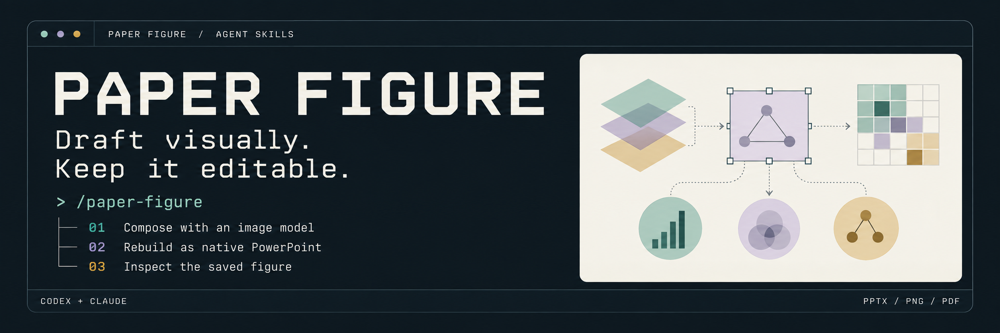
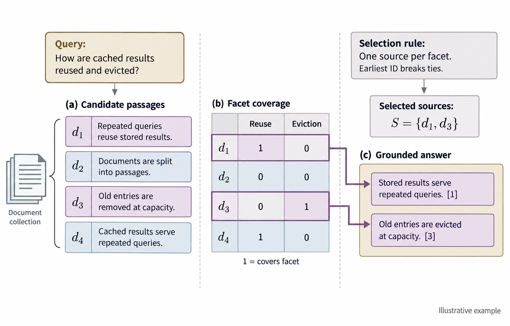
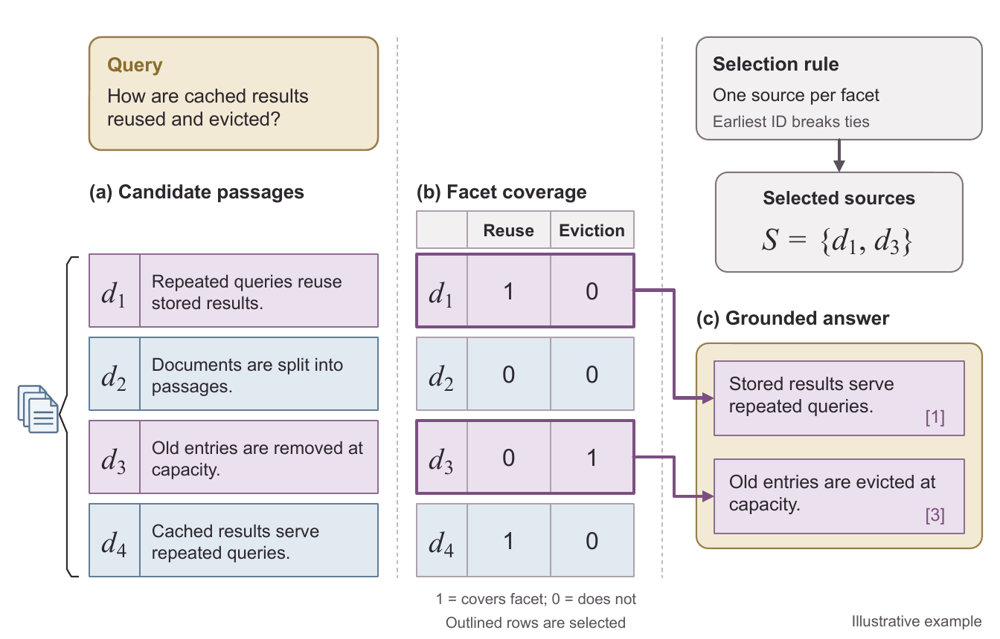
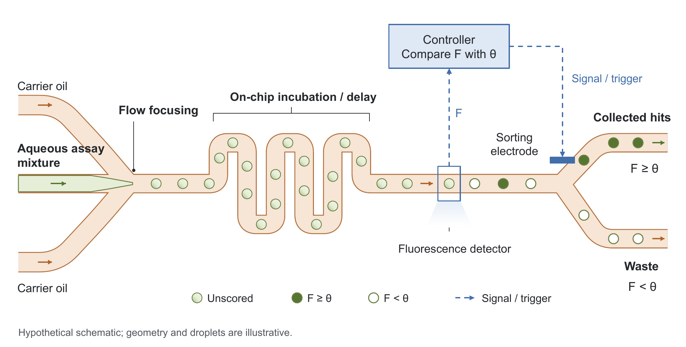
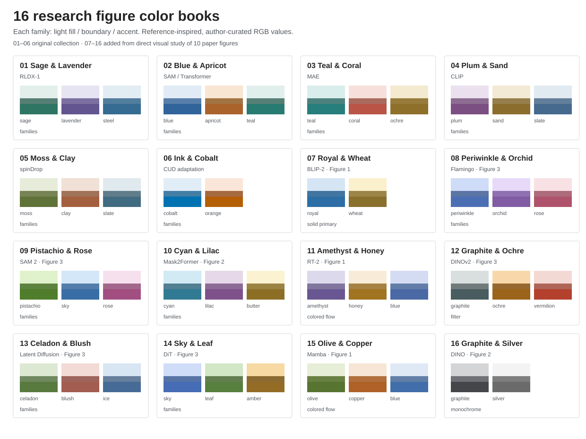

<p align="center">
  
</p>

<h1 align="center">연구의 구도를 잡고, 끝까지 편집 가능한 figure로.</h1>

<p align="center">이미지 모델의 시각 초안을 편집형 PowerPoint로.<br/>Codex·Claude와 함께 구도를 설계하고, 설명을 재구성하고, 저장된 결과를 검토하세요.</p>

<p align="center">
  <a href="https://github.com/JYS1025/paper-figure/stargazers"></a>
  <a href="https://github.com/JYS1025/paper-figure/forks"></a>
  <a href="https://github.com/JYS1025/paper-figure/watchers"></a>
  <a href="docs/repository-badges.md"></a>
</p>

<p align="center"><a href="#빠른-시작"></a></p>

<p align="center"><a href="#빠른-시작">빠른 시작</a> · <a href="#초안에서-편집형-figure로">결과물 보기</a> · <a href="#제작-과정">제작 과정</a> · <a href="#color-books">Color books</a> · <a href="#문서">문서</a></p>
<p align="center"><a href="README.md">English</a> · <a href="README.ko.md">한국어</a></p>

스타·포크·구독자는 매일 갱신하며, 조회수는 표시된 날짜 기준 GitHub 최근 14일 통계입니다. [집계 안내](docs/repository-badges.md).

---

## 초안에서 편집형 figure로

시각적인 방향을 먼저 탐색하고, 글자·도형·첨자·연결선을 PowerPoint에서 수정할 수 있는 결과물로 완성합니다.

<table>
<tr>
<th width="50%">01 &nbsp; 이미지 모델의 전체 초안</th>
<th width="50%">02 &nbsp; PowerPoint 객체로 재구성</th>
</tr>
<tr>
<td valign="top"><a href="docs/images/document-evidence-draft.png"></a></td>
<td valign="top"><a href="docs/images/document-evidence.png"></a></td>
</tr>
<tr>
<td>구도, 시각적 위계, 색상의 역할을 탐색합니다.</td>
<td>라벨·수식·행렬·화살표는 네이티브 객체, 픽토그램은 교체 가능한 이미지입니다.</td>
</tr>
</table>

**실제 파일로 확인하세요:** [편집형 PPTX](output/image-draft-sample-12/figure-v2.pptx) · [PDF](output/image-draft-sample-12/figure.pdf) · [전체 크기 비교](output/image-draft-sample-12/draft-vs-pptx.png) · [제작 기록](output/image-draft-sample-12/report.txt)

가상의 문서 근거 예시입니다. 최종 미리보기는 저장된 PPTX에서 렌더링했으며, 그 파일에 전체 초안 이미지를 넣지 않았습니다.

<details>
<summary><strong>다른 예시 보기: 미세유체 액적 선별</strong></summary>



채널 경로, 액적, 라벨, 제어 연결이 네이티브 객체인 가상 과정도입니다. 장치 형상과 액적은 설명용 예시입니다.

[편집형 PPTX](output/image-first-test-03/figure.pptx) · [PDF](output/image-first-test-03/figure.pdf) · [이미지 모델 초안](output/image-first-test-03/image-draft.png) · [제작 기록](output/image-first-test-03/report.md)

</details>

## Paper Figure의 설계

<table>
<tr>
<td width="50%" valign="top">
<h3>01 · 시각적 방향부터</h3>
<p>이미지 모델로 전체 구도를 탐색합니다. 초안을 검토하고 효과적인 배치와 위계를 최종 figure에 반영합니다.</p>
</td>
<td width="50%" valign="top">
<h3>02 · 개별 편집 가능한 객체</h3>
<p>PowerPoint에서 라벨, 모듈, 행렬 셀, 화살표를 수정합니다. 삽화는 독립적으로 배치하고 교체할 수 있습니다.</p>
</td>
</tr>
<tr>
<td width="50%" valign="top">
<h3>03 · 논문 크기에서의 디테일</h3>
<p>16개 color book을 활용하고, 실제 게재 폭에서 관계 표현, 회색조 가독성, 렌더링된 글꼴과 첨자를 검토합니다.</p>
</td>
<td width="50%" valign="top">
<h3>04 · 다음 수정까지 고려</h3>
<p>최신 PPTX에서 요청한 부분만 수정합니다. 사용자가 조정한 내용을 보존하고 저장된 결과를 확인합니다.</p>
</td>
</tr>
</table>

모델 구조도, 방법론, 과정도, 개념 설명 figure를 위한 스킬입니다. 통계 그래프와 일반 발표용 슬라이드는 범위에 포함하지 않습니다.

## 빠른 시작

### 1. 터미널에서 설치

설치에는 **Node.js 22.20+**와 Git이 필요합니다. [skills CLI](https://github.com/vercel-labs/skills)를 사용하므로 ZIP을 직접 내려받지 않아도 됩니다. 스킬을 사용할 프로젝트 폴더에서 환경에 맞는 명령을 실행하세요.

현재 저장소는 **Private**이므로 접근 권한이 있는 GitHub 계정이 필요합니다. [GitHub CLI](https://cli.github.com/)를 설치한 뒤 처음 한 번 인증합니다.

```sh
gh auth login
gh auth setup-git
```

**Codex**

```sh
npx --yes skills@1.7.0 add https://github.com/JYS1025/paper-figure/tree/main/skills/paper-figure --agent codex --copy
```

**Claude Code**

```sh
npx --yes skills@1.7.0 add https://github.com/JYS1025/paper-figure/tree/main/ports/claude/paper-figure --agent claude-code --copy
```

각 환경에 맞는 버전을 독립된 복사본으로 설치합니다. 두 환경을 함께 쓰면 `--copy`를 유지하세요. 스킬 이름은 `paper-figure`로 같지만 제작 엔진이 다릅니다. 모든 프로젝트에서 쓰려면 `--global`, 설치 확인을 생략하려면 `--yes`를 덧붙입니다. 업데이트할 때는 스킬의 직접 수정 내용을 백업하고 같은 버전의 설치 명령을 다시 실행하세요. 해당 설치본이 교체됩니다.

| 범위 | Codex | Claude Code |
|---|---|---|
| 현재 프로젝트 (기본) | `.agents/skills/paper-figure/` | `.claude/skills/paper-figure/` |
| 모든 프로젝트 (`--global`) | `~/.agents/skills/paper-figure/` | `~/.claude/skills/paper-figure/` |

두 배포 경로 모두 `SKILL.md` 진입점을 포함합니다. 이 저장소에는 프로젝트용 스킬 연결도 있으므로 저장소를 복제한 경우 바로 탐색할 수 있습니다. 스킬이 보이지 않으면 새 세션에서 확인하세요. [설치 상세·문제 해결](docs/installation.md).

<details>
<summary>ZIP 설치 및 claude.ai</summary>

[Codex ZIP](output/paper-figure-skill.zip) · [Claude ZIP](output/paper-figure-claude-skill.zip)

압축을 푼 `paper-figure` 폴더를 위 표의 스킬 폴더에 넣습니다. claude.ai에서는 코드 실행·파일 생성이 가능한 환경에서 Claude ZIP을 사용자 지정 스킬로 업로드하세요. CLI는 로컬 에이전트의 스킬을 설치하며 클라우드 계정에는 업로드하지 않습니다.

</details>

### 2. 필요한 도구 확인

새 figure에는 전체 구도 초안과 필요한 삽입용 자료를 만드는 **이미지 생성 도구**, 저장된 PPTX의 모습을 검토하는 **렌더러**가 필요합니다. 스킬 패키지는 지침과 제작 도구를 제공하며, 모델 접근과 렌더링 기능은 실행 환경에서 준비합니다.

| 기능 | Codex 버전 | Claude 버전 |
|---|---|---|
| PPTX 제작 | `@oai/artifact-tool`과 Presentations 도구가 번들로 제공되는 Codex 환경 | 공개 PptxGenJS 엔진과 Python 도구 |
| 이미지 초안 | 세션에서 사용할 수 있는 이미지 생성 도구 | 연결된 이미지 생성 도구, MCP 서버 또는 사용 가능한 API 통합 |
| 구조 검사 | `lxml`이 있는 Python | `lxml`·`Pillow`가 있는 Python |
| 렌더링 | 번들 LibreOffice/Poppler 또는 PowerPoint | 사용 가능한 LibreOffice/Poppler, 환경에서 지원하는 렌더러 또는 PowerPoint |
| 수식 렌더 검사 | `pdfplumber`가 있는 Python | `pdfplumber`가 있는 Python |

Codex 버전은 실행 환경의 번들 제작 도구에 의존합니다. Claude 버전은 공개 라이브러리를 사용하며, [환경 설정 안내](ports/claude/paper-figure/references/claude-environment.md)에 필요한 구성을 정리했습니다. 스킬 설치만으로 이미지 생성 서비스가 연결되지는 않습니다. 이미지 생성 기능이 없으면 PPTX 제작 전에 해당 제약을 보고합니다.

<details>
<summary>Claude 제작 엔진의 로컬 환경 설정</summary>

Node.js 20+와 Python 3.10+를 사용합니다. 쓰기 가능한 Claude 스킬 폴더에서 현재 환경을 먼저 확인합니다.

```sh
node scripts/preflight.mjs
```

패키지가 없고 설치가 허용된 환경에서는 다음 macOS/Linux 명령으로 로컬 설치할 수 있습니다.

```sh
npm install --omit=dev
python3 -m venv .venv
.venv/bin/python -m pip install -r requirements.txt
export FIGURE_PYTHON="$PWD/.venv/bin/python"
node scripts/preflight.mjs
```

LibreOffice, Poppler, 글꼴은 별도의 시스템 구성 요소입니다. 사전 점검 명령은 로컬 의존성을 확인하며 이미지 생성 서비스 연결은 검사하지 않습니다. 공용 패키지 경로와 렌더링 래퍼 설정은 [환경 안내](ports/claude/paper-figure/references/claude-environment.md)를 참고하세요.

</details>

### 3. 만들 figure 설명

Codex에서는 `paper-figure`, Claude Code에서는 `/paper-figure`를 호출하고 방법론, 필수 관계, 표기법, 논문 게재 폭을 알려주세요. claude.ai에서는 활성화된 Paper Figure 스킬로 작업하도록 요청합니다.

```text
폭 178mm의 편집 가능한 논문 방법론 figure를 만들어줘.

입력 → 인코더 → 잠재표현 → 디코더와 입력에서 디코더로 가는
스킵 연결을 포함해. 제공한 설명의 기호와 표기법을 유지해.

먼저 전체 이미지 초안을 생성하고 검토한 다음, 글자·도형·연결선을
PowerPoint의 네이티브 객체로 재구성해. 필요한 삽화는 별도로 생성해.
PPTX, 저장된 파일에서 렌더링한 미리보기, 선택한 초안과 검증 요약을 제공해줘.
```

수정할 때는 최신 PPTX를 함께 전달합니다.

```text
이 최신 PPTX에서 “Decoder”만 “Reconstruction head”로 바꿔줘.
내가 수정한 위치와 색상, 나머지 내용은 유지하고 새 파일로 저장해줘.
```

## 제작 과정

| 단계 | 수행 내용 |
|---|---|
| **1. 내용 정의** | 그리기 전에 필수 라벨, 구성 요소, 방향 관계, 수식 표기, 학습·추론 구분을 기록합니다. |
| **2. 시각 표현 검토** | 관련 논문 figure를 살펴보고, 게재 폭과 의미에 따른 색상 역할을 결정합니다. |
| **3. 전체 구도 초안** | 이미지 모델로 전체 figure를 생성·검토하고, 유지할 요소와 고칠 요소를 기록합니다. |
| **4. 편집형 재구성** | 설명 요소를 PowerPoint 객체로 만듭니다. 필요한 삽입용 이미지와 아이콘은 별도로 생성합니다. |
| **5. 저장 결과 검증** | 내용과 연결선을 검사하고 PPTX를 렌더링합니다. 수식·회색조 가독성을 확인하고 초안과 비교합니다. |

선택한 초안, 실제 프롬프트, 재구성 결정은 작업 기록으로 남깁니다. 전체 초안 이미지는 최종 PPTX에 넣지 않습니다. 기존 figure의 국소 수정은 최신 파일을 보존하며 새 구도 초안을 요구하지 않습니다. 사용자가 초안 생략이나 제공 이미지의 정확한 재현을 명시한 경우에는 그 경로를 별도로 기록합니다.

자세한 기준은 [전체 초안 제작 절차](skills/paper-figure/references/image-first.md)를 참고하세요.

## 제공 결과물

| 결과물 | 용도 |
|---|---|
| **편집형 `.pptx`** | PowerPoint에서 글자·도형·그룹·연결선을 계속 수정합니다. |
| **저장 파일의 미리보기** | 실제 PPTX에서 만든 PNG와, 렌더러가 지원하는 경우 PDF를 확인합니다. |
| **선택한 시각 초안** | 재구성의 바탕이 된 구도를 확인합니다. |
| **검증 요약** | 실행한 내용·렌더링·수식 검사와 남아 있는 제약을 확인합니다. |
| **작업 자료** | 이후 수정을 위해 프롬프트, 재구성 결정, 생성 이미지, 검사 기록을 보관합니다. |

간단한 수식은 글자 크기와 첨자 위치 또는 서식을 조정한 편집형 텍스트로 만듭니다. 삽입 이미지는 독립적으로 이동·크기 조절·자르기·교체할 수 있으며, 내부 픽셀은 래스터로 유지됩니다.

## Color books

**16개 배색 조합**에 채움·외곽선·강조색, 중립색, 참고 논문의 관찰을 담았습니다. 색상은 공유 모듈, 조건 입력, 선택된 근거, 대기 상태처럼 연구 내용의 역할에 배정하고 실제 figure 안에서 검토합니다.

<details>
<summary>16개 color book 미리보기</summary>



</details>

HEX 값은 레퍼런스를 참고해 구성한 배색입니다. 원 논문에서 사용한 정확한 팔레트로 주장하지 않습니다.

[선택 지침](skills/paper-figure/references/color-books.md) · [색상 데이터](skills/paper-figure/assets/color-books.json) · [개별 카드](skills/paper-figure/assets/color-books) · [레퍼런스 분석](skills/paper-figure/references/reference-cards.md)

## 검증과 현재 지원 범위

구조 검사, 렌더링 검토, 실제 앱 편집, 독립 모델 평가는 구분하여 기록합니다.

| 검증 항목 | 기록된 결과 |
|---|---|
| 공개 제작 엔진 회귀 검사 | 연결 누락·역방향, 오래된 수정 요청, 이미지 자르기, 변경하지 않은 파일 내용 보존 등을 포함해 **38개 통과**. |
| Claude 엔진으로 복잡한 기존 figure 재구성 | 저장된 PPTX에서 **네이티브 도형 196개, 연결선 10개, 그룹 16개, 독립 이미지 1개** 유지. |
| 해당 재구성의 수식 렌더 검사 | **14개 영역**에서 선택한 기준에 따른 문자 누락, 예상 밖 글꼴, 작은 첨자 경고 없음. |
| Claude 스킬 배포 패키지 | ZIP을 별도 위치에 풀어 시험 파일을 생성하고 내용·연결선 검사 통과. |

이 결과는 로컬 제작 엔진의 동작을 검증합니다. Claude Code·claude.ai 안에서의 전체 실행과 최신 이식 버전의 PowerPoint 수동 편집은 아직 검증하지 않았습니다. 기록된 렌더링 경로는 LibreOffice → PDF → Poppler입니다. 자세한 내용은 [Claude 이식 검증 기록](docs/claude-port-validation.json)에 있습니다.

복잡한 수식 조판, 연결선 경로 재설정, 연결된 그룹 이동에는 적절한 네이티브 편집 경로가 필요합니다. 글꼴과 렌더러에 따라 표시가 달라질 수 있습니다. 그림을 축소하면 글자와 첨자도 함께 작아지므로 실제 게재 폭에서 검토해야 합니다.

요청 시에는 출처 인식과 시각적 품질을 분리하는 [블라인드 평가 절차](skills/paper-figure/references/blind-review.md)를 사용합니다. 기존 정성 비교는 한계를 명시한 진단 기록이며, 출판된 figure에 대한 일반적인 품질 우위를 입증하지 않습니다.

## 문서

| 주제 | 안내 |
|---|---|
| CLI 설치 | [설치·업데이트·문제 해결](docs/installation.md) |
| 저장소 배지 | [집계 출처와 갱신 방식](docs/repository-badges.md) |
| 스킬 진입점 | [Codex](skills/paper-figure/SKILL.md) · [Claude](ports/claude/paper-figure/SKILL.md) |
| 제작 도구와 환경 | [Codex](skills/paper-figure/references/authoring.md) · [Claude](ports/claude/paper-figure/references/authoring.md) |
| Claude 설치 | [환경 설정](ports/claude/paper-figure/references/claude-environment.md) · [한국어 설치 안내](ports/claude/INSTALL.txt) |
| 이미지와 픽토그램 | [자료의 역할과 생성 기준](skills/paper-figure/references/visual-assets.md) |
| 수식 표기 | [편집형 조판과 렌더 검사](skills/paper-figure/references/math-typography.md) |
| 과학적 관계 | [연결 지점·집합·항목 대응](skills/paper-figure/references/relationship-review.md) |
| 기존 PPTX 수정 | [검토와 보존](skills/paper-figure/references/review-and-editing.md) |
| 평가 | [통제 비교 절차](skills/paper-figure/references/evaluation.md) · [블라인드 평가](skills/paper-figure/references/blind-review.md) |

## 저장소 구성

```text
skills/paper-figure/        Codex 스킬, 레퍼런스 분석, color book
ports/claude/paper-figure/  Claude 스킬과 공개 제작 엔진
scripts/                   패키징·저장소 배지 도구
tests/                     엔진·수정 보존 검사
docs/                      설계 자료와 검증 기록
output/                    스킬 ZIP과 생성 예시
```

## 기여

재현 가능한 렌더링 결함, 과학적 관계 오류, 글꼴 문제, 레퍼런스 분석, 근거가 있는 스킬 개선을 환영합니다. 오류를 보고할 때는 실행 환경, 스킬 버전, 최소한의 설명 또는 공유 가능한 PPTX, 기대한 동작, 실제 저장 파일의 미리보기를 함께 제공해주세요.

공통 설계 지침의 변경은 두 버전에 반영합니다. 제작 엔진을 변경할 때는 관련 내용 검사와 렌더링 검토를 포함하고, 수정 기능을 시험할 때는 사용자의 수동 편집을 보존해야 합니다.

## 라이선스와 출처

저장소 전체에 적용할 라이선스는 아직 선택하지 않았습니다. 포함된 샘플 이미지와 color book의 출처는 [자료 출처](skills/paper-figure/assets/SOURCES.md)에, 참고 논문은 [레퍼런스 분석](skills/paper-figure/references/reference-cards.md)과 색상 데이터에 기록했습니다.

---

<p align="center"><strong>연구의 다음 수정을 위해.</strong><br/>Paper Figure가 도움이 되었다면 별을 눌러 다른 연구자에게도 알려주세요.<br/><a href="#기여">기여 안내</a> · <a href="#빠른-시작">시작하기</a></p>
