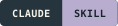

<p align="center">
  
</p>

<h1 align="center">Research figures, built for the next revision.</h1>

<p align="center">From an image-model draft to editable PowerPoint.<br/>Compose, reconstruct and review research figures with Codex and Claude.</p>

<p align="center">
  <a href="skills/paper-figure/SKILL.md"></a>
  <a href="ports/claude/paper-figure/SKILL.md"></a>
  <a href="output/image-draft-sample-12/figure-v2.pptx"></a>
  <a href="skills/paper-figure/assets/color-books.json"></a>
  <br/>
  <a href="skills/paper-figure/references/image-first.md"></a>
  <a href="docs/claude-port-validation.json"></a>
  <a href="ports/claude/paper-figure/references/claude-environment.md"></a>
  <a href="ports/claude/paper-figure/references/claude-environment.md"></a>
</p>

<p align="center">
  <a href="output/paper-figure-skill.zip"></a>
  &nbsp;
  <a href="output/paper-figure-claude-skill.zip"></a>
</p>

<p align="center"><a href="#quick-start">Quick start</a> · <a href="#from-draft-to-editable-figure">See the output</a> · <a href="#how-it-works">Workflow</a> · <a href="#color-books">Color books</a> · <a href="#documentation">Docs</a></p>
<p align="center"><a href="README.md">English</a> · <a href="README.ko.md">한국어</a></p>

---

## From draft to editable figure

Start with a visual direction. Finish with text, shapes, indices and connectors you can revise in PowerPoint.

<table>
<tr>
<th width="50%">01 &nbsp; Image-model draft</th>
<th width="50%">02 &nbsp; Native PowerPoint reconstruction</th>
</tr>
<tr>
<td valign="top"><a href="docs/images/document-evidence-draft.png"></a></td>
<td valign="top"><a href="docs/images/document-evidence.png"></a></td>
</tr>
<tr>
<td>Composition, visual hierarchy and color roles.</td>
<td>Native labels, math, matrix cells and arrows; one replaceable pictogram.</td>
</tr>
</table>

**Try the actual file:** [Editable PPTX](output/image-draft-sample-12/figure-v2.pptx) · [PDF](output/image-draft-sample-12/figure.pdf) · [Full-size comparison](output/image-draft-sample-12/draft-vs-pptx.png) · [Generation record](output/image-draft-sample-12/report.txt)

This is an illustrative document-evidence example. The final preview was rendered from the saved PPTX; the full draft is not embedded in that file.

<details>
<summary><strong>Explore another example: microfluidic sorting</strong></summary>


A hypothetical process figure with native channel paths, droplets, labels and control connections. Geometry and droplets are illustrative.

[Editable PPTX](output/image-first-test-03/figure.pptx) · [PDF](output/image-first-test-03/figure.pdf) · [Image-model draft](output/image-first-test-03/image-draft.png) · [Generation record](output/image-first-test-03/report.md)

</details>

## Why Paper Figure

<table>
<tr>
<td width="50%" valign="top">
<h3>01 · Visual direction first</h3>
<p>Explore a complete composition with an image model. Review the draft and carry its strongest layout decisions into the final figure.</p>
</td>
<td width="50%" valign="top">
<h3>02 · Objects you can edit</h3>
<p>Revise native PowerPoint labels, modules, matrix cells and arrows. Keep illustrations separate and replaceable.</p>
</td>
</tr>
<tr>
<td width="50%" valign="top">
<h3>03 · Detail at paper scale</h3>
<p>Choose from 16 color books. Check visible relationships, grayscale readability, rendered fonts and mathematical scripts at the intended width.</p>
</td>
<td width="50%" valign="top">
<h3>04 · Preserve the next revision</h3>
<p>Make targeted changes to the latest saved PPTX. Preserve manual adjustments and inspect the result before delivery.</p>
</td>
</tr>
</table>

Built for model architectures, methodology figures, process diagrams and conceptual explanations. Statistical plotting and general presentation decks are outside the skill's scope.

## Quick start

### 1. Install the skill for your environment

| Environment | Package | Installation |
|---|---|---|
| Codex | [Codex ZIP](output/paper-figure-skill.zip) | Extract the `paper-figure` folder into your project's `.agents/skills/`. |
| Claude Code | [Claude ZIP](output/paper-figure-claude-skill.zip) | Extract into `.claude/skills/` for one project, or `~/.claude/skills/` for personal use. |
| claude.ai | [Claude ZIP](output/paper-figure-claude-skill.zip) | Upload the ZIP as a custom skill in an environment with code execution and file creation enabled. |

The resulting skill folder must contain `SKILL.md` directly. When working in this repository, project skill links are already included for Codex and Claude Code. Start a new session after installation if the skill is not yet visible.

### 2. Check the required tools

New figures use an **image-generation tool** for the full composition draft and any requested pictorial assets. A **saved-PPTX renderer** is also required for visual verification. The skill package supplies instructions and authoring helpers; model access and rendering tools come from the host environment.

| Capability | Codex edition | Claude edition |
|---|---|---|
| PPTX authoring | Codex environment with bundled `@oai/artifact-tool` and Presentations tooling | Public PptxGenJS engine with Python helpers |
| Image drafting | Available image-generation tool in the session | Connected image-generation tool, MCP server or authorized API integration |
| Structural checks | Python with `lxml` | Python with `lxml` and `Pillow` |
| Rendering | Bundled LibreOffice/Poppler or PowerPoint | Available LibreOffice/Poppler, host-supported renderer or PowerPoint |
| Rendered math checks | Python with `pdfplumber` | Python with `pdfplumber` |

The Codex edition depends on its host's bundled authoring runtime. The Claude edition uses public dependencies; see its [environment guide](ports/claude/paper-figure/references/claude-environment.md). Installing a skill does not configure an image provider. If image generation is unavailable, the skill reports the missing capability before native construction.

<details>
<summary>Local setup for the Claude authoring engine</summary>

Use Node.js 20+ and Python 3.10+. From a writable copy of the Claude skill folder, check the existing environment first:

```sh
node scripts/preflight.mjs
```

If packages are missing and installation is allowed, these macOS/Linux commands install them locally:

```sh
npm install --omit=dev
python3 -m venv .venv
.venv/bin/python -m pip install -r requirements.txt
export FIGURE_PYTHON="$PWD/.venv/bin/python"
node scripts/preflight.mjs
```

LibreOffice, Poppler and fonts are separate system dependencies. The preflight command checks local dependencies; it does not check image-provider connections. See the [environment guide](ports/claude/paper-figure/references/claude-environment.md) for shared package paths and rendering wrappers.

</details>

### 3. Describe your figure

Invoke `paper-figure` in Codex or `/paper-figure` in Claude Code, then provide the method, required relationships, notation and intended paper width. In claude.ai, ask the enabled Paper Figure skill to handle the request.

```text
Create an editable methodology figure for a research paper, 178 mm wide.

Show input → encoder → latent representation → decoder, with a skip
connection from input to decoder. Preserve the notation in my description.

Generate and inspect a full visual draft first, then reconstruct the figure
with native PowerPoint text, shapes and connectors. Generate any needed
illustrations separately. Return the PPTX, a preview rendered from the saved
file, the selected draft and a concise validation note.
```

For revisions, provide the latest PPTX:

```text
In this saved PPTX, change “Decoder” to “Reconstruction head”.
Preserve my module positions, colors and all other edits. Save a new file.
```

## How it works

| Stage | What happens |
|---|---|
| **1. Define the content** | Record required labels, entities, directed relationships, notation and training/inference distinctions before drawing. |
| **2. Study the visual language** | Inspect relevant reference figures, select the paper width and assign colors to meaningful roles. |
| **3. Draft the full composition** | Generate a complete visual draft with an image model, inspect it and record what to preserve or correct. |
| **4. Rebuild for editing** | Construct explanatory elements as native PowerPoint objects. Generate final pictorial assets separately when needed. |
| **5. Validate the saved result** | Check content and connectors, render the PPTX, inspect typography and grayscale readability, and compare the reconstruction with the draft. |

The selected draft, actual prompt and transfer decisions remain part of the work record. The full raster draft is kept outside the final PPTX. Local edits preserve the latest file and do not restart composition drafting. An explicit request to skip drafting, or to reproduce a supplied image exactly, is recorded as a separate route.

See the [complete drafting workflow](skills/paper-figure/references/image-first.md).

## What you receive

| Output | Purpose |
|---|---|
| **Editable `.pptx`** | Continue editing text, shapes, groups and connectors in PowerPoint. |
| **Saved-file preview** | Review a PNG and, when supported by the renderer, a PDF of the actual PPTX output. |
| **Selected visual draft** | See the composition that informed the reconstruction. |
| **Validation note** | Understand which content, rendering and typography checks ran, with any unresolved limitations. |
| **Supporting files** | Retain prompts, transfer decisions, generated assets and inspection reports for later revisions. |

Simple formulas use editable text with deliberate script placement or formatting. Pictures can be moved, resized, cropped and replaced; their internal pixels remain raster content.

## Color books

The collection includes **16 palettes** with separate fill, stroke and accent levels, neutral colors and reference observations. Colors are assigned to scientific roles—such as shared modules, conditioning, selected evidence or pending states—and reviewed in the context of the figure.

<details>
<summary>Preview the 16 color books</summary>


</details>

The HEX values are authored adaptations informed by reference figures. They are not claimed to be the original papers' palettes.

[Selection guide](skills/paper-figure/references/color-books.md) · [Palette data](skills/paper-figure/assets/color-books.json) · [Individual cards](skills/paper-figure/assets/color-books) · [Reference studies](skills/paper-figure/references/reference-cards.md)

## Validation and current scope

The project records structural checks, rendered review, native-application editing and independent model evaluation separately.

| Evidence | Recorded result |
|---|---|
| Portable engine regression checks | **38 passed**, including missing/reversed edges, stale edits, picture crops and preservation of untouched package content. |
| Complex figure replay through the Claude engine | **196 native shapes, 10 connectors, 16 groups and one independent picture** preserved in the saved PPTX. |
| Rendered math checks on that replay | **14 regions checked**, with no flagged character omissions, unexpected fonts or undersized scripts under the selected thresholds. |
| Packaged Claude skill | Extracted ZIP generated a fixture and passed content and connector checks. |

These results establish local engine behavior. End-to-end execution inside Claude Code or claude.ai and manual PowerPoint editing of the latest port have not yet been verified. The recorded render path used LibreOffice → PDF → Poppler. Details are in the [Claude port validation record](docs/claude-port-validation.json).

Advanced equation layout, complex connector rerouting and connected-group moves require an appropriate native editing path. Font availability and renderer differences can affect appearance. Review at the intended paper width; reducing the figure also reduces every label and subscript.

When requested, the skill provides a [blind-review protocol](skills/paper-figure/references/blind-review.md) that separates source recognition from visual quality. Existing qualitative comparisons are documented as diagnostics, with their limitations; they do not establish a general quality advantage over published figures.

## Documentation

| Topic | Guide |
|---|---|
| Skill entry points | [Codex](skills/paper-figure/SKILL.md) · [Claude](ports/claude/paper-figure/SKILL.md) |
| Authoring and runtime | [Codex](skills/paper-figure/references/authoring.md) · [Claude](ports/claude/paper-figure/references/authoring.md) |
| Claude installation | [Setup guide](ports/claude/paper-figure/references/claude-environment.md) · [한국어 설치 안내](ports/claude/INSTALL.txt) |
| Images and pictograms | [Asset roles and generation](skills/paper-figure/references/visual-assets.md) |
| Mathematical notation | [Editable typography and rendered checks](skills/paper-figure/references/math-typography.md) |
| Scientific relationships | [Endpoints, sets and identity across views](skills/paper-figure/references/relationship-review.md) |
| Existing PPTX files | [Review and preservation](skills/paper-figure/references/review-and-editing.md) |
| Evaluation | [Controlled comparison protocol](skills/paper-figure/references/evaluation.md) · [Blind review](skills/paper-figure/references/blind-review.md) |

## Repository layout

```text
skills/paper-figure/        Codex skill, reference studies and color books
ports/claude/paper-figure/  Claude skill and public authoring engine
scripts/                   Packaging utilities
tests/                    Engine and preservation checks
docs/                     Design notes and validation records
output/                   Skill ZIPs and generated examples
```

## Contributing

Useful contributions include reproducible rendering defects, scientific-relationship errors, font issues, reference studies and evidence-backed improvements to the skill. For a bug report, include the host environment, skill edition, a minimal brief or shareable PPTX, the expected behavior and the actual saved-file preview.

Changes to shared design guidance should be reflected in both editions. Include the relevant content and rendering checks when changing the authoring engine, and preserve human edits when testing revision workflows.

## License and attribution

A repository-wide license has not yet been selected. Attribution for bundled sample media and the color-book resources is recorded in [asset sources](skills/paper-figure/assets/SOURCES.md). Reference papers are credited in the [reference studies](skills/paper-figure/references/reference-cards.md) and palette data.

---

<p align="center"><strong>For the next revision of your research.</strong><br/>If Paper Figure helps your work, a star helps other researchers find it.<br/><a href="#contributing">Contribute</a> · <a href="#quick-start">Get started</a></p>
