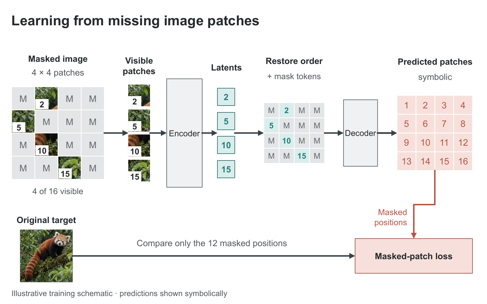
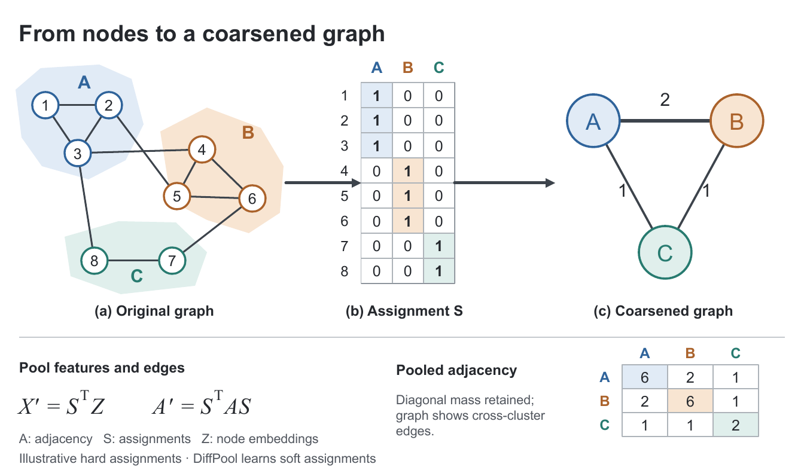
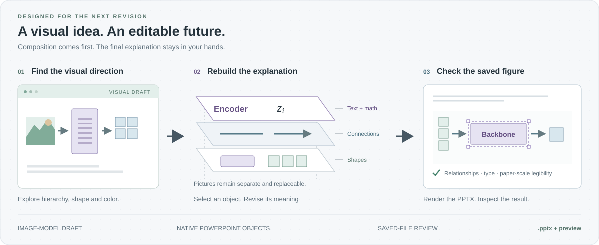

<p align="center">
  
</p>

<h1 align="center">Research figures, built for the next revision.</h1>

<p align="center">From an image-model draft to editable PowerPoint.<br/>Compose, reconstruct and review research figures with Codex, Claude and Antigravity CLI.</p>

<p align="center">
  <a href="https://github.com/JYS1025/paper-figure/stargazers"></a>
  <a href="https://github.com/JYS1025/paper-figure/forks"></a>
  <a href="https://github.com/JYS1025/paper-figure/watchers"></a>
  <a href="docs/repository-badges.md"></a>
</p>

<p align="center"><a href="#quick-start"></a></p>

<p align="center"><a href="#quick-start">Quick start</a> · <a href="#from-draft-to-editable-figure">See the output</a> · <a href="#how-it-works">Workflow</a> · <a href="#color-books">Color books</a> · <a href="#documentation">Docs</a></p>
<p align="center"><a href="README.md">English</a> · <a href="README.ko.md">한국어</a></p>

Stars, forks and watchers refresh daily; views show a dated GitHub 14-day snapshot. [Badge details](docs/repository-badges.md).

> **Claude & Antigravity CLI:** choose **Gemini API** for image-model drafting, or **no API** for direct native authoring. Both routes produce editable PowerPoint. The optional Gemini client and private key-registration helper are included. [Modes and setup](docs/claude-image-generation.md).

---

## From draft to editable figure

Start with a visual direction. Finish with text, shapes, indices and connectors you can revise in PowerPoint.

<table>
<tr>
<th width="50%">01 &nbsp; Image-model draft</th>
<th width="50%">02 &nbsp; Native PowerPoint reconstruction</th>
</tr>
<tr>
<td valign="top"><a href="docs/images/document-evidence-draft.png"></a></td>
<td valign="top"><a href="docs/images/document-evidence.png"></a></td>
</tr>
<tr>
<td>Composition, visual hierarchy and color roles.</td>
<td>Native labels, math, matrix cells and arrows; one replaceable pictogram.</td>
</tr>
</table>

**Try the actual file:** [Editable PPTX](output/image-draft-sample-12/figure-v2.pptx) · [PDF](output/image-draft-sample-12/figure.pdf) · [Full-size comparison](output/image-draft-sample-12/draft-vs-pptx.png) · [Generation record](output/image-draft-sample-12/report.txt)

This is an illustrative document-evidence example. The final preview was rendered from the saved PPTX; the full draft is not embedded in that file.

### Masked image modeling



One independently generated source photograph, nine replaceable picture objects, and native patch IDs, masks, modules and arrows. The same four patch identities survive every stage. Predictions are symbolic; this is an illustrative training schematic, not a model result. Visual principles studied from [MAE](https://arxiv.org/abs/2111.06377).

[Editable PPTX](output/gallery-masked-reconstruction-14/figure-v2.pptx) · [PDF](output/gallery-masked-reconstruction-14/figure.pdf) · [Image-model draft](output/gallery-masked-reconstruction-14/image-draft.png) · [Draft → PPTX comparison](output/gallery-masked-reconstruction-14/draft-vs-pptx.png) · [Generation record](output/gallery-masked-reconstruction-14/report.md)

### Graph pooling



Every hull, node, edge, matrix cell and mathematical label is a native PowerPoint object. Cluster identity is encoded by both color and IDs, and the pooled adjacency is checked against the original graph. This hard-assignment toy example is inspired by [DiffPool](https://arxiv.org/abs/1806.08804), which learns soft assignments.

[Editable PPTX](output/gallery-graph-pooling-15/figure-v2.pptx) · [PDF](output/gallery-graph-pooling-15/figure.pdf) · [Image-model draft](output/gallery-graph-pooling-15/image-draft.png) · [Draft → PPTX comparison](output/gallery-graph-pooling-15/draft-vs-pptx.png) · [Generation record](output/gallery-graph-pooling-15/report.md)

These two examples were generated in Codex and previewed from the saved PPTX files. They demonstrate the workflow and output format; they are not end-to-end Claude execution tests.

<details>
<summary><strong>Explore another example: microfluidic sorting</strong></summary>


A hypothetical process figure with native channel paths, droplets, labels and control connections. Geometry and droplets are illustrative.

[Editable PPTX](output/image-first-test-03/figure.pptx) · [PDF](output/image-first-test-03/figure.pdf) · [Image-model draft](output/image-first-test-03/image-draft.png) · [Generation record](output/image-first-test-03/report.md)

</details>

## Why Paper Figure



<table>
<tr>
<td width="50%" valign="top">
<h3>01 · Visual direction first</h3>
<p>Explore a complete composition with an image model. Review the draft and carry its strongest layout decisions into the final figure.</p>
</td>
<td width="50%" valign="top">
<h3>02 · Objects you can edit</h3>
<p>Revise native PowerPoint labels, modules, matrix cells and arrows. Keep illustrations separate and replaceable.</p>
</td>
</tr>
<tr>
<td width="50%" valign="top">
<h3>03 · Detail at paper scale</h3>
<p>Choose from 16 color books. Check visible relationships, grayscale readability, rendered fonts and mathematical scripts at the intended width.</p>
</td>
<td width="50%" valign="top">
<h3>04 · Preserve the next revision</h3>
<p>Make targeted changes to the latest saved PPTX. Preserve manual adjustments and inspect the result before delivery.</p>
</td>
</tr>
</table>

Built for model architectures, methodology figures, process diagrams and conceptual explanations. Statistical plotting and general presentation decks are outside the skill's scope.

## Quick start

### 1. Install from your terminal

Codex and Claude use [skills CLI](https://github.com/vercel-labs/skills), requiring **Node.js 22.20+** and Git. Antigravity uses its own plugin installer. No ZIP download is needed. Run the command for your agent below.

While this repository is **private**, your GitHub account needs access. With [GitHub CLI](https://cli.github.com/) installed, set up authentication once:

```sh
gh auth login
gh auth setup-git
```

**Codex**

```sh
npx --yes skills@1.7.0 add https://github.com/JYS1025/paper-figure/tree/main/skills/paper-figure --agent codex --copy
```

**Claude Code**

```sh
npx --yes skills@1.7.0 add https://github.com/JYS1025/paper-figure/tree/main/ports/claude/paper-figure --agent claude-code --copy
```

**Antigravity CLI**

```sh
gh repo clone JYS1025/paper-figure paper-figure
agy plugin install ./paper-figure/ports/antigravity/plugin
```

Install [Antigravity CLI (`agy`)](https://antigravity.google/docs/cli/install) first. If you already cloned this repository, run only the second command with its actual path. Check `agy plugin list`, then invoke `/paper-figure` in a new Antigravity session. The plugin is installed for your user account. [Google transitioned individual users from Gemini CLI to Antigravity CLI](https://developers.googleblog.com/an-important-update-transitioning-gemini-cli-to-antigravity-cli/); Gemini API remains the optional image provider.

The edition-specific commands keep independent copies. Keep `--copy` on the Codex and Claude commands: the editions share the name `paper-figure` but use different authoring engines. For the Codex/Claude `skills` CLI commands, append `--global` to install for all projects, or `--yes` to skip the install confirmation. For updates, back up local edits and follow the [edition-specific update steps](docs/installation.md#verify-and-update).

| Scope | Codex | Claude Code | Antigravity CLI |
|---|---|---|---|
| Project | `.agents/skills/paper-figure/` | `.claude/skills/paper-figure/` | Use the user plugin |
| User | `~/.agents/skills/paper-figure/` | `~/.claude/skills/paper-figure/` | `~/.gemini/antigravity-cli/plugins/paper-figure/` |

All three editions have `SKILL.md` entry points. The repository includes local Codex and Claude links; install the Antigravity plugin explicitly. Antigravity also discovers `.agents/skills/`, so check for an existing Codex edition of the same skill in your target project. Start a new session if the skill is not yet visible. [Installation details and troubleshooting](docs/installation.md).

<details>
<summary>ZIP installation and claude.ai</summary>

[Codex ZIP](output/paper-figure-skill.zip) · [Claude ZIP](output/paper-figure-claude-skill.zip) · [Antigravity plugin ZIP](output/paper-figure-antigravity-plugin.zip)

For Codex/Claude, extract the `paper-figure` folder into the appropriate skills directory above. For Antigravity, extract the plugin ZIP and run `agy plugin install /path/to/extracted/paper-figure`. For claude.ai, upload the Claude ZIP as a custom skill in an environment with code execution and file creation enabled; the CLI installs local agent skills, not cloud account skills.

</details>

### 2. Check the required tools

Claude and Antigravity CLI ask which mode to use for a new figure, unless you already specified one:

| Mode | Workflow | Image key |
|---|---|---|
| **Gemini API** | Generate a full composition draft, inspect it, then rebuild native PowerPoint objects. | Required; Google API access, quota and billing apply. |
| **No API** | Review references and color roles, then build native shapes, text and math directly. | Not required. |

The choice is reused within the task. Both modes retain saved-file rendering, relationship checks and typography review. No-API mode can use supplied images and native pictograms; it does not generate a new photographic asset or claim an image-model draft.

If you choose Gemini API and have no key, the skill links to [Google AI Studio](https://aistudio.google.com/apikey) and guides you to run this **in your own terminal**, from the installed Claude/Gemini skill folder:

```sh
python3 scripts/gemini_image.py setup
python3 scripts/gemini_image.py status
```

The hidden-input helper stores the key outside the project. Existing `PAPER_FIGURE_GEMINI_API_KEY`, `GOOGLE_API_KEY` or `GEMINI_API_KEY` environment variables also work. Never paste a key into chat. `status` checks local presence only. Antigravity CLI sign-in is separate from image API access. [Credential details and limits](docs/claude-image-generation.md).

| Capability | Codex edition | Claude / Antigravity CLI editions |
|---|---|---|
| PPTX authoring | Bundled `@oai/artifact-tool` and Presentations tooling | Public PptxGenJS engine with Python helpers |
| Image drafting | Available host image-generation tool | Optional included Gemini API client; direct native mode also supported |
| Structural checks | Python with `lxml` | Python with `lxml` and `Pillow` |
| Rendering | Bundled LibreOffice/Poppler or PowerPoint | Available LibreOffice/Poppler, host renderer or PowerPoint |
| Rendered math checks | Python with `pdfplumber` | Python with `pdfplumber` |

A saved-PPTX renderer is required for visual verification in every mode. The Codex edition uses its host's bundled runtime. The portable editions use public dependencies; their Gemini client requires network access, Python and Pillow. Installing a skill does not create an account, enable billing or supply a key. API failures are reported without silently changing your selected mode.

<details>
<summary>Local setup for the Claude / Antigravity CLI authoring engine</summary>

Use Node.js 20+ and Python 3.10+. From a writable copy of either portable skill folder, check the existing environment first:

```sh
node scripts/preflight.mjs
```

If packages are missing and installation is allowed, these macOS/Linux commands install them locally:

```sh
npm install --omit=dev
python3 -m venv .venv
.venv/bin/python -m pip install -r requirements.txt
export FIGURE_PYTHON="$PWD/.venv/bin/python"
node scripts/preflight.mjs
```

LibreOffice, Poppler and fonts are separate system dependencies. The preflight command checks local dependencies and credential presence; it does not call the API or verify model access. See the [environment guide](ports/claude/paper-figure/references/claude-environment.md) for shared package paths and rendering wrappers.

</details>

### 3. Describe your figure

Invoke `paper-figure` in Codex, `/paper-figure` in Claude Code, or `/paper-figure` in Antigravity CLI, then provide the method, required relationships, notation and intended paper width. In claude.ai, ask the enabled Paper Figure skill to handle the request.

```text
Create an editable methodology figure for a research paper, 178 mm wide.

Show input → encoder → latent representation → decoder, with a skip
connection from input to decoder. Preserve the notation in my description.

Generate and inspect a full visual draft first, then reconstruct the figure
with native PowerPoint text, shapes and connectors. Generate any needed
illustrations separately. Return the PPTX, a preview rendered from the saved
file, the selected draft and a concise validation note.
```

For revisions, provide the latest PPTX:

```text
In this saved PPTX, change “Decoder” to “Reconstruction head”.
Preserve my module positions, colors and all other edits. Save a new file.
```

## How it works

With image drafting enabled, the workflow is below. Claude and Antigravity CLI also support no-API mode, which proceeds directly from reference and palette review to native authoring.

| Stage | What happens |
|---|---|
| **1. Define the content** | Record required labels, entities, directed relationships, notation and training/inference distinctions before drawing. |
| **2. Study the visual language** | Inspect relevant reference figures, select the paper width and assign colors to meaningful roles. |
| **3. Draft the full composition** | Generate a complete visual draft with an image model, inspect it and record what to preserve or correct. |
| **4. Rebuild for editing** | Construct explanatory elements as native PowerPoint objects. Generate final pictorial assets separately when needed. |
| **5. Validate the saved result** | Check content and connectors, render the PPTX, inspect typography and grayscale readability, and compare the reconstruction with the draft. |

The selected draft, actual prompt and transfer decisions remain part of the work record. The full raster draft is kept outside the final PPTX. Local edits preserve the latest file and do not restart composition drafting. An explicit request to skip drafting, or to reproduce a supplied image exactly, is recorded as a separate route.

See the [complete drafting workflow](skills/paper-figure/references/image-first.md).

## What you receive

| Output | Purpose |
|---|---|
| **Editable `.pptx`** | Continue editing text, shapes, groups and connectors in PowerPoint. |
| **Saved-file preview** | Review a PNG and, when supported by the renderer, a PDF of the actual PPTX output. |
| **Selected visual draft** | Included when image drafting was used. |
| **Validation note** | Understand which content, rendering and typography checks ran, with any unresolved limitations. |
| **Supporting files** | Retain prompts, transfer decisions, generated assets and inspection reports for later revisions. |

Simple formulas use editable text with deliberate script placement or formatting. Pictures can be moved, resized, cropped and replaced; their internal pixels remain raster content.

## Color books

The collection includes **16 palettes** with separate fill, stroke and accent levels, neutral colors and reference observations. Colors are assigned to scientific roles—such as shared modules, conditioning, selected evidence or pending states—and reviewed in the context of the figure.

<details>
<summary>Preview the 16 color books</summary>


</details>

The HEX values are authored adaptations informed by reference figures. They are not claimed to be the original papers' palettes.

[Selection guide](skills/paper-figure/references/color-books.md) · [Palette data](skills/paper-figure/assets/color-books.json) · [Individual cards](skills/paper-figure/assets/color-books) · [Reference studies](skills/paper-figure/references/reference-cards.md)

## Validation and current scope

The project records structural checks, rendered review, native-application editing and independent model evaluation separately.

| Evidence | Recorded result |
|---|---|
| Automated regression tests | **124 passed**, including 54 preservation cases across all three editions and four package-reference checks. |
| Portable engine fixture checks | **33 passed** on fresh fixtures, including missing/reversed edges, stale edits, picture crops and untouched-package preservation. |
| Complex figure replay through the Claude engine | **196 native shapes, 10 connectors, 16 groups and one independent picture** preserved in the saved PPTX. |
| Rendered math checks on that replay | **14 regions checked** with Liberation Serif explicitly selected; no flagged omissions, unexpected fonts or undersized scripts under the selected thresholds. The initial font-substitution diagnostic is retained. |
| All three packages | Extracted ZIPs generated fixtures and passed content, connector, reordered-slide and report-collision checks. |

These results establish local engine behavior. End-to-end figure creation by Claude Code, claude.ai or Antigravity CLI agents and manual PowerPoint editing of the latest ports have not yet been verified. The optional Gemini client has offline transport/credential tests; a paid live image request is not claimed. [Portable image-mode validation](docs/portable-image-validation.json). The recorded render path used LibreOffice → PDF → Poppler. Current results, fixes and exact source/package hashes are in the [independent-review corrections](docs/independent-review-fixes.md) and [validation record](docs/preservation-fixes-validation.json). Earlier results remain in the [historical Claude port record](docs/claude-port-validation.json).

Advanced equation layout, complex connector rerouting and connected-group moves require an appropriate native editing path. Font availability and renderer differences can affect appearance. Review at the intended paper width; reducing the figure also reduces every label and subscript.

When requested, the skill provides a [blind-review protocol](skills/paper-figure/references/blind-review.md) that separates source recognition from visual quality. Existing qualitative comparisons are documented as diagnostics, with their limitations; they do not establish a general quality advantage over published figures.

## Documentation

| Topic | Guide |
|---|---|
| CLI installation | [Commands, updates and troubleshooting](docs/installation.md) |
| Repository badges | [Counter sources and refresh](docs/repository-badges.md) |
| Skill entry points | [Codex](skills/paper-figure/SKILL.md) · [Claude](ports/claude/paper-figure/SKILL.md) · [Antigravity CLI](ports/antigravity/plugin/skills/paper-figure/SKILL.md) |
| Authoring and runtime | [Codex](skills/paper-figure/references/authoring.md) · [Claude](ports/claude/paper-figure/references/authoring.md) |
| Claude installation | [Setup guide](ports/claude/paper-figure/references/claude-environment.md) · [한국어 설치 안내](ports/claude/INSTALL.txt) |
| Antigravity installation | [Setup guide](ports/antigravity/plugin/skills/paper-figure/references/antigravity-environment.md) · [한국어 설치 안내](ports/antigravity/INSTALL.txt) |
| Images and pictograms | [Asset roles and generation](skills/paper-figure/references/visual-assets.md) |
| Mathematical notation | [Editable typography and rendered checks](skills/paper-figure/references/math-typography.md) |
| Scientific relationships | [Endpoints, sets and identity across views](skills/paper-figure/references/relationship-review.md) |
| Existing PPTX files | [Review and preservation](skills/paper-figure/references/review-and-editing.md) |
| Evaluation | [Controlled comparison protocol](skills/paper-figure/references/evaluation.md) · [Blind review](skills/paper-figure/references/blind-review.md) |

## Repository layout

```text
skills/paper-figure/        Codex skill, reference studies and color books
ports/claude/paper-figure/  Claude skill and public authoring engine
ports/antigravity/plugin/  Antigravity CLI plugin with the synced portable skill
scripts/                   Packaging and repository badge utilities
tests/                    Engine and preservation checks
docs/                     Design notes and validation records
output/                   Skill ZIPs and generated examples
```

## Contributing

Useful contributions include reproducible rendering defects, scientific-relationship errors, font issues, reference studies and evidence-backed improvements to the skill. For a bug report, include the host environment, skill edition, a minimal brief or shareable PPTX, the expected behavior and the actual saved-file preview.

Changes to shared design guidance should be reflected in all editions. Run `python3 scripts/sync-antigravity-port.py` after changing the shared portable engine or guidance in the Claude port. Include the relevant content and rendering checks when changing the authoring engine, and preserve human edits when testing revision workflows.

## License and attribution

A repository-wide license has not yet been selected. Attribution for bundled sample media and the color-book resources is recorded in [asset sources](skills/paper-figure/assets/SOURCES.md). Reference papers are credited in the [reference studies](skills/paper-figure/references/reference-cards.md) and palette data.

---

<p align="center"><strong>For the next revision of your research.</strong><br/>If Paper Figure helps your work, a star helps other researchers find it.<br/><a href="#contributing">Contribute</a> · <a href="#quick-start">Get started</a></p>
