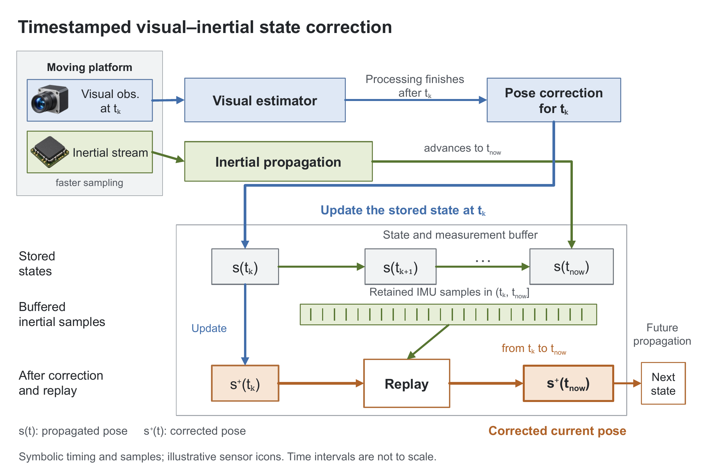

# 생성 아이콘과 편집형 다이어그램의 분리

스킬을 수정하고, 기존 센서 융합 예시에 이미지 생성기로 만든 **카메라·관성 센서 아이콘 두 개**를 삽입했습니다. 생성 대상은 삽입용 시각 자료뿐입니다. 라벨·수식·시간 표시·상태 도형·버퍼·화살표는 PowerPoint 객체로 유지했습니다.

[편집형 PPTX](figure.pptx) · [PDF](figure.pdf) · [생성 프롬프트](assets/prompts.json) · [카메라 원본](assets/camera.png) · [관성 센서 원본](assets/inertial-sensor.png)

## 스킬에 반영한 원칙

- 장비·물체·시료·장면 등 설명에 도움이 되는 삽화와 아이콘은 생성해 독립된 그림 객체로 삽입합니다. 투명 배경과 일관된 스타일을 지정하고, 실제 사용할 크기에서 확인합니다.
- 이미지 프롬프트에는 텍스트·수식·축·화살표·연결선·다이어그램을 포함하지 않습니다. 이 요소들은 편집 가능한 객체로 작성합니다.
- 그림 개수 0개를 편집성이나 품질의 지표로 삼지 않습니다. 생성한 시각 자료가 최종 PPTX에 실제로 들어갔는지, 허용한 그림 외에 전체 다이어그램을 덮는 이미지가 없는지 확인합니다.
- 그림은 각각 이동·크기 조절·자르기·교체할 수 있습니다. 내부 픽셀을 벡터 부품처럼 편집할 수 있다는 뜻은 아닙니다. 원본 PNG와 실제 생성 프롬프트를 함께 제공합니다.

재사용 지침: [visual-assets.md](../../skills/paper-figure/references/visual-assets.md), [SKILL.md](../../skills/paper-figure/SKILL.md).

## 적용과 확인

기존 [센서 융합 PPTX](../unseen-suite-05/timestamped-fusion/figure.pptx)를 보존하고 새 파일로 저장했습니다. 두 입력 상자의 공간과 라벨 여백, 그 상자에서 출발하는 연결선의 시작 위치, 삽화 안내 문구만 조정했습니다. 나머지 설명 구조를 그대로 유지했습니다.

| 확인 항목 | 결과 |
|---|---|
| 저장된 객체 | native shape 57개, connector 12개, group 2개, picture 2개 |
| 생성 원본 | 각각 1254×1254 RGBA, 투명 배경 유지 |
| 그림 삽입 | 이름과 개수 확인; PPTX 내부 이미지가 원본 PNG와 바이트 단위로 동일 |
| 내용과 연결 | 필수 native 라벨·도형·12개 연결 검사 통과 |
| 파일 검사 | 패키지·레이아웃·폰트 검사 및 다시 읽기 통과 |
| 렌더 검토 | 저장된 PPTX를 300dpi로 렌더링하고, 폭 177.8mm 기준 축소본 및 흑백본 확인 |

아이콘과 텍스트가 겹치지 않고, 투명 배경이 정상적으로 표시되며, 설명 경로와 아래첨자가 유지되는 것을 확인했습니다. 자동 레이아웃 검사의 연결선 영역 경고 2개는 기존 파일에서도 있던 항목이며, 실제 렌더링에서 해당 선은 텍스트를 지나지 않았습니다. [검증 기록](../../docs/validation/hybrid-assets-test-06/result.json).

아이콘은 특정 실험 장비의 사진이나 측정 결과가 아닌 대표 삽화입니다. 이번 확인은 저장된 파일과 렌더링에 관한 것이며, PowerPoint에서 직접 클릭해 편집하는 시험이나 새 블라인드 평가는 수행하지 않았습니다.
