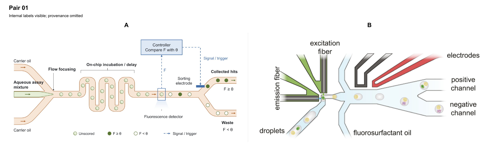

# 라벨을 유지한 블라인드 평가

두 검증 세션 모두 **실제 논문인 B를 선택**했고, 출판 여부와 별개인 **전체 시각 품질은 생성본 A를 선호**했습니다. 생성본의 큰 구조적 결함은 찾지 않았으며 화살표를 일괄적으로 두껍게 할 필요도 없다고 평가했습니다.

| 검증 | 실제 논문 추정 | 주관적 확신도 | 정답 | 구도 기억 | 전체 시각 품질 선호 |
|---|---|---|---|---|---|
| 1 | B | 70/100 | B | 없음 | A |
| 2 | B | 80/100 | B | 없음 | A |

확신도는 보정된 확률이나 품질 점수가 아닙니다. 동일한 한 쌍을 새 맥락 두 곳에서 평가했으며, 표본 두 쌍이나 서로 다른 모델의 결과로 계산하지 않습니다.

## 무엇을 시험했나

- **A:** 이미지 모델의 초안을 참고하여 native PowerPoint 객체로 재구성한 [최신 figure](../image-first-test-03/figure.png). 검증에는 저장된 PPTX에서 렌더링한 PNG를 사용했습니다. 이미지 모델의 원본 초안을 대신 제출하지 않았습니다.
- **B:** De Jonghe et al., *spinDrop: a droplet microfluidic platform to maximise single-cell sequencing information content*, Nature Communications 14, 4788 (2023)의 [Figure 1C 장치 도식](https://www.nature.com/articles/s41467-023-40322-w/figures/1).
- **라벨 처리:** 모든 내부 라벨과 범례를 유지했습니다. 원 논문에서는 C 패널의 도식만 추출하여 패널 문자·사진·외부 캡션을 제외했습니다. 생성본에서는 바깥쪽의 “Hypothetical schematic; geometry and droplets are illustrative.” 설명만 제외했습니다. 내부 문구를 덮거나 바꾸지 않았습니다.
- **배치:** 검증 결과를 받기 전에 비교 대상과 범위를 정하고 A/B를 무작위로 배치했습니다. 종횡비를 보존하여 같은 폭에 제시했습니다. 판독용 A·B 확대본은 같은 영역이며 추가 표본이 아닙니다.
- **범위 차이:** A는 전체 공정 개요, B는 국소 검출·선별 장치도입니다. 두 방법의 장치 세부와 생물학적 대상도 다릅니다. 이 차이를 평가자에게 알리고, 한쪽에만 있는 구체성을 무조건 요구하지 않도록 했습니다.

## 실제 논문이라고 추정한 근거와 품질 판단

두 검증 모두 B의 광섬유 끝단, 좁은 검출 위치, 오일 유입부, 분기 전극이 이루는 **특정 장치의 공간 관계**를 출처 추정의 주요 근거로 들었습니다. A는 F·θ·제어기·출구 조건을 일관된 기호 체계로 정리한 전체 과정도여서 생성된 설명 그림으로 추정했습니다. 두 표현 방식 모두 실제 논문에서도 가능하다는 유보를 함께 적었습니다.

반면 전달 명료성, 위계와 구성, 타이포그래피에서는 두 검증 모두 A를 선호했습니다. 색과 대비도 A를 약간 선호했습니다. 연속된 채널, 수평 물질 경로와 상부 제어 경로의 분리, 명시적인 두 출구 조건, 채움·비움·수식을 함께 쓴 상태 구분이 강점이었습니다. B는 방법에 특화된 장치 배치의 구체성에서 더 높은 평가를 받았습니다.

따라서 이번 쌍에서는 **생성 출처를 알아보는 것과 시각적 품질이 낮다고 보는 것이 일치하지 않았습니다.** 얇은 화살표나 파스텔 배색을 주된 문제로 지적하지 않았습니다. 이것이 모든 도식에서 그런 요소가 무관하다는 일반적 증명은 아닙니다.

## 남은 피드백

| 제안 | 제시한 검증 | 성격 | 적용 조건과 완료 기준 |
|---|---|---|---|
| F와 θ, 액적 채움의 의미를 짧게 정의 | 1 | 조건부 설명 개선 | 단독 사용하거나 캡션에도 정의가 없다면, F는 측정 형광, θ는 선별 임계값이며 채움은 판정 상태를 나타낸다고 설명. 실제 방법에 없는 단위·신호 정의는 추가하지 않음. 그림 또는 인접 캡션만으로 기호와 상태를 설명할 수 있으면 완료. |
| Unscored와 음성 액적의 명도 차이 보강 | 2 | 마무리 수정 | 연한 채움과 빈 원은 확대하면 구별되지만 작은 크기·낮은 대비에서는 비슷해질 수 있음. 채움의 명도를 조정하거나 판정 상태임이 명확한 비색상 표식을 검토. 최종 게재 크기와 흑백에서 세 상태가 범례대로 구별되면 완료. |
| 검출 액적과 전극 작동 시점의 대응 설명 | 2 | 조건부 설명 개선 | 실제 방법에서 액적별 지연 보정·추적이 중요하고 그 원리를 설명해야 할 때만 추가. 단순 개요이면 현 수준도 충분함. 임의의 시간값·추적 모듈·하드웨어는 추가하지 않음. |

두 검증 모두 큰 구조적 결함을 확인하지 못했습니다. 물질 경로와 분기, 검출→제어→전극 연결, 액적 정체성 및 판정 상태의 연결을 읽을 수 있다고 했습니다. 위 피드백은 모두 화살표 두께만으로 해결되는 문제가 아닙니다. 평가를 위해 figure나 스킬을 수정하지 않았습니다.

## 해석의 한계

이 결과는 서로 다른 범위와 방법을 가진 한 쌍에 관한 정성적 진단입니다. 이미지 초안을 이용하는 제작법이 직접 PPTX를 만드는 방법보다 우수하다는 통제 실험은 아닙니다. 이전의 라벨을 가린 시험과는 노출 정보·비교 범위·평가 맥락이 달라 확신도 변화를 개선 점수로 읽을 수 없습니다.

검증자는 모두 부모 세션의 모델 설정을 상속한 GPT-6 기반 Codex이며, 정확한 제공 버전은 노출되지 않았습니다. 새로운 맥락을 사용했지만 서로 다른 모델이나 서비스는 아닙니다. 읽기 대상을 프롬프트와 익명화한 이미지 세 개로 제한했고, 정답·생성 경로·이전 평가·예상 수정사항은 제공하지 않았습니다. 이는 맥락 분리이며 운영체제 수준의 파일 접근 격리는 아닙니다. 평가 전문을 편집하지 않고 먼저 저장·해시 기록한 후 정답과 대조했습니다. 두 평가자 모두 구도를 기억해서 알아본 것은 아니라고 보고했습니다.

원 논문의 캡션과 방법은 평가자에게 제공하지 않았습니다. B의 작은 광학 화살표처럼 역할을 단정할 수 없는 세부도 조건부 지적으로 남겼으며, 실제 논문의 과학적 오류를 확인한 결과로 취급하지 않습니다. 그림의 읽기 가능성 검토와 실험 방법의 타당성 검증은 구분해야 합니다.

## 원문과 재사용 자료

- [검증 1의 수정하지 않은 응답](review-01.md)
- [검증 2의 수정하지 않은 응답](review-02.md)
- [두 검증에 공통으로 제공한 프롬프트](blind/evaluator-prompt.md)
- [익명 비교 PNG](blind/pair-01.png), [비교 PDF](blind/comparison.pdf), [A 확대본](blind/A.png), [B 확대본](blind/B.png)
- [대상 PPTX](../image-first-test-03/figure.pptx), [제작 기록](../image-first-test-03/report.md)
- [세션·입력 해시·결과 기록](../../docs/validation/image-first-blind-test-04/session.json), [정답·크롭·출처 기록](../../docs/validation/image-first-blind-test-04/answer-key.json)

참조 이미지 출처: De Jonghe et al., 2023, 위 Figure 1C. [원 논문](https://www.nature.com/articles/s41467-023-40322-w)의 [CC BY 4.0](https://creativecommons.org/licenses/by/4.0/) 조건에 따라 사용했습니다. 원본을 도식 영역으로 크롭하고 비교 크기에 맞춰 배치했으며 내부 내용·색·라벨은 변경하지 않았습니다. 원본 저자나 출판사의 승인·보증을 뜻하지 않습니다.
